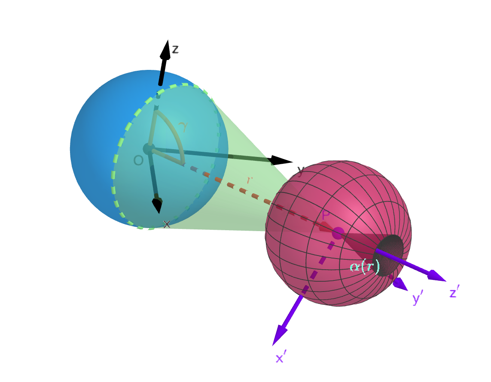

# Thruster Pointing Constrained Optimal Control for Satellite Servicing using Indirect Optimization
This repository contains code to generate results in two journal publications, 3DOF [1] and 6DOF [2].
### Code accompanying journal paper [1] 

Core functions: (also explained in 'ExampleCode.m') 

1. SolvePointingConstrainedControlProblem.m - Core function which implements the thruster pointing constrained control problem and solves is using a single shooting method. The constraint is illustrated in the figure below.

     

2. ConstrainedApproachTestCondition.m - Contains the initial conditions for various transfer types.
3. SweepSolutions.m - Useful to sweep the smoothing paramete rho or target radius via continuation methods.

### Code accompanying journal paper [2] 
1. Solve6DOFPointingConstrainedControlProblem - Solves a single instance of the 6DOF constrained problem using single shooting. 
2. ConstrainedApproachTestCondition.m - Contains the initial conditions for various transfer types.
3. PlotsFor6DOF_ConstraintPaper - Some example code to illustrate the process of generating figures in the journal paper

**References**

[1] Panag H. and Woollands R. M., "Thruster-Pointing-Constrained Optimal Control for Satellite Servicing Using Indirect Optimization", Journal of Spacecraft and Rockets, Published Online 24 Oct 2024, https://doi.org/10.2514/1.A36064

[2] Panag H, Bommena R. and Woollands R. M., "Thruster Pointing Constrained Fuel Optimal 6DOF Proximity Operations Using Indirect Methods", The Journal of Astronautical Sciences, Vol 73, Article 24 (2026), https://link.springer.com/article/10.1007/s40295-026-00572-4
